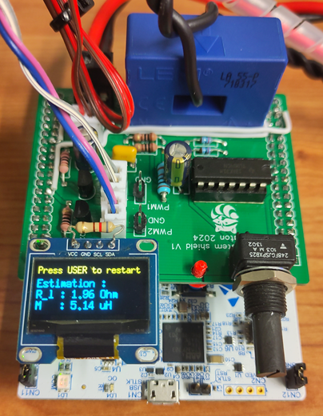

# Wireless-power-transfer-system_nucleo

This is the repository of a parameters identification technique for a wireless power transfer system implemented on a NucleoG474RE dev board. The technique is based on impedance spectroscopy with noise injection followed by a neural network estimator to estimates teh wanted parameters.

## custom shield

A shield was made for this purpose and can be found here : https://oshwlab.com/thomasboulanger2503/shield-wpt-nucleo-g474re

# Getting started

If you want to run more than juste the embedded project, it will be usefull to create a custom python environment with the requiered packages. To do it with conda, you can run the following commands :
* `conda create --name WPT_env` to create a new env
* `conda actvate WPT_env` to get into the env
* `conda install --yes --file requirements.txt` to install the requiered packages
 
## Embedded project

The `WPT_system` folder contain the STM32 CubeMX project. 
To use it, open the folder with STM32CubeIDE, connect the board to the computer and click on `Run WPT_system Debug` to compile and upload the code on the board. Once done, the board can run an analysis when the USER button is pressed. If the line 63 of `WPT_system\Core\Src\main.c` is left uncommented (`SEND_DATA` is defined), the data are transfered through UART to be analysed and visualised with a computer. However, this slow down the estimation as the sending of the impedance through UART take a few seconds.

## Neural Network

The `neural_network` folder contain scripts and class to create a dataset, train a model and convert a model to a `.onnx`.
* To create a dataset, run `python neural_network\dataset_creation.py`.
* To train the model defined in `neural_network\model_class.py` with the dataset, run `python neural_network\train.py`. The training can be monitored with tensorboard which need to be runned first. 
* To convert the trained model to a `.onnx`, first specify the model path in `neural_network\torch_to_onnx.py` and then run `python neural_network\torch_to_onnx.py`.

## Python script

The `script` folder contain the main script to analyse the data from an analysis, it enable the visualisation of the impedance and compare it with the model. An offline estimation of the parameters is made with the 
To do so run `python script/data_receiver.py` wait for the script to print `Ready to receive data` before starting an identification by pushing the USER button on the board. Ensure that line 63 of `WPT_system\Core\Src\main.c` is uncommented and `SEND_DATA` is defined. 

